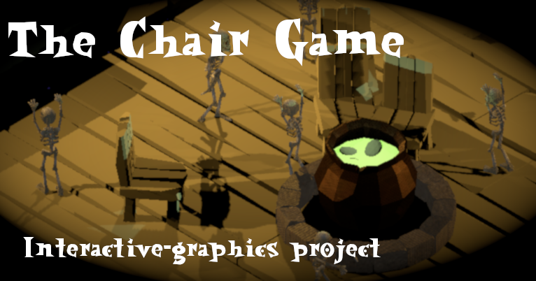

# The Chair Game
Hello spooky fellow and welcome to `The Chair Game` where you will have to find a seat before everyone else does, or else you will be kicked off the Manor of Spokiness for the __ETERNITY__

The game was developed as final project for the `Interactive Graphics` course held by professor `Marco Schaerf` during July 2020.

## Play the game
Before taking your favourite seat, you may want to inspect for a moment these instructions:

* Use the menu in the upper-right region of the screen in order to select the number of foes and the difficulty level, then press `Start Game` in order to begin the first game phase. __Dont worry if you dont see the chairs... they will soon arrive!__.
* You can move your skeleton by using `WASD` keys.
* Once the chair spawns, quickly rush towards one of the chairs! If your skeleton succesfully captures a chair, he will start dancing.
* Once all chairs are occupied, one skeleton (hopefully not you) will die, one chair will be removed and a new match begins... The game ends when only one skeleton (hopefully you) survives.

You can test the current build of the game [here](https://sapienzainteractivegraphicscourse.github.io/final-project-eg-t/)

If you want to read more about the game's development, you can read the documentation [here](https://github.com/SapienzaInteractiveGraphicsCourse/final-project-eg-t/blob/master/giacomini_1743995.pdf)

## Known bugs
Here is a list of known bugs from the game:

* There is a chance that chairs configuration will create some corners inside the scene and skeletons may get stuck in there, forcing the game to continue for eternity.

## Contributors
The game is fully developed by `Emanuele Giacomini`.

However it is important to also mention the set of modules and extra elements used to fully develop every aspect of the game:

* The game relies on [THREE JS](https://threejs.org/) library.
* Perlin noise used by the AI for random walks is based on [NoiseJS](https://github.com/josephg/noisejs) from __josephg__
* The game's GUI is based on [dat.GUI](https://github.com/dataarts/dat.gui) from __dataarts__.
* The Skeleton model was made by the user __Akseley__ and it is available [here](https://skfb.ly/SMxS).
* All other models present in the game are made by `Emanuele Giacomini`.
